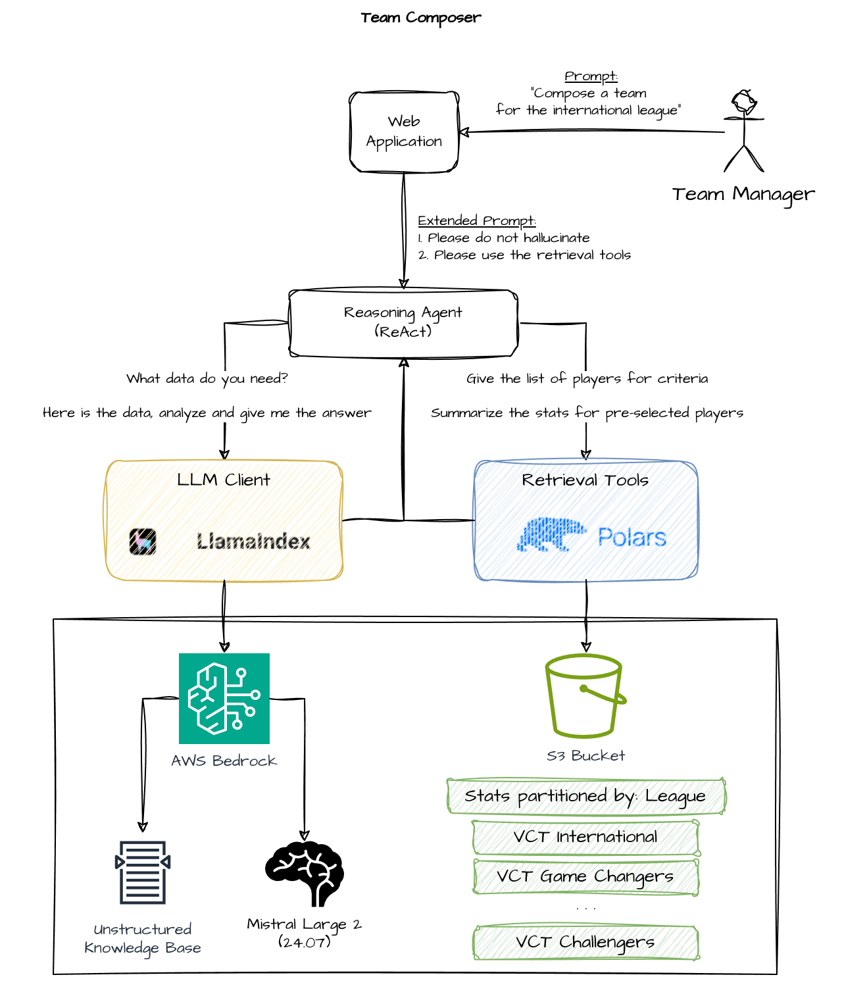

# Reasoning Agent for the Team Composition Task

## Intro

In this Python application I explored how to build a reasoning agent using [Amazon Bedrock](https://aws.amazon.com/ai/generative-ai). The goal was to build a simple application with a chat interface that can compose a team for the Valorant game. The app needs to take into account the constraints specified in the prompt and assign team roles based on the historical performance of each player. The organizers of this hackathon supplied a lot of data in the form of JSON files and hinted they expected a RAG architecture to be implemented. The goal was to balance the cost, complexity and the quality of the solution, so things like fine-tuning the model and brining third-party models were discouraged.

I have tested a few approaches and decided to go with the following architecture:



Here is how it works:

1. The user submits their prompt to compose a team to a web application - Gradio app
2. The app dispatches this request to a reasoning agent - ReActAgent from LlamaIndex lib
3. The agent calls LLM with the expanded prompt and the list of tools - Mistral Large 2 model
4. The agent calls tools as guided by the LLM and adds game stats data to the context - Polars lib
5. After several iterations, the agent gets the final response from LLM and returns it to the user.

Initially, I was also planning to add `fandom` and `wiki` data to the Knowledge Base, but the model I used (`mistral.mistral-large-2407-v1:0`) was already knowledgeable enough about the game, so in my final implementation I decided to cut the cost and not use the KB. In the real application, I would probably want to still use it to provide more context about the domain to the model. This is specifically true in the following situations:

* Using the older model that might not have enough data about the domain
* Using the data from the private domain (enterprise data)

### Diversity and Inclusion

One of the goals I personally wanted to achieve is to remove or minimize the bias from the decision making process which would ensure giving the same probability to enter the shortlist of the team selection process. Exiting from the shortlist is part of the model reasoning and is biased by definition (the model is expected to pick the right players and assign the roles to them according to their historical performance). However, if the model was presented with the full list of players and their stats to pick the team members, it would tend to pick the top-performers only in each league thus not giving a chance for other players to become part of the team.

There are a couple of things that I have implemented to address that bias:

1. The initial shortlist of players is created randomly. The model is instructed (by the extended prompt) to use the tool to create a shortlist of N (N = 10, in my case) players. The tool ensures the constraints (such as the league name or region) are applied to filter the players and then choose N **random** players from the filtered list.

2. The tools and LLM only refer to the players by their IDs. Players' names and slugs are never used in the reasoning process to ensure the LLM is not able to use this data for reasoning. In theory, the player's name like "super-fragger" may impact the reasoning results.

Balancing the number N is a tricky thing. On one hand, we want to make it large enough to supply LLM with enough data to reason about. One extreme would be setting N = F, where F is the complete filtered data set. This will diminish the goal of giving the same probability to all players to be selected in the team (see explanation above). Another extreme would be setting N = T, where T is the number of players in a team (5). This will ensure the same probability of inclusion, but will not supply enough data for the model to reason about (each player must be selected to the team). Unfortunately, I don't have enough knowledge to make an educated guess here. My naive approach was to double the number of players in the shortlist so that the model has an opportunity to choose from them. In future, I would like to implement and test a more sophisticated strategy, for example, choosing two capitains and then taking turns to complete two teams.

## Preparing Data

Working with the provided data was the most time-consuming part of the project. I have decided to normalize the provided data and put it into an S3 bucket in the delta format. I've also decided to pre-process the game data and summarize it before the tools can use it.

### Fixture Data

Fixture data is data about the leagues, tournaments, teams and players. It is commonly refered to as master data. I have extracted it from JSON files, converted to Polars dataframes, joined into a single table:

```python
    fixture_data = (
        leagues.join(tournaments, on="league_id", how="left")
        .join(teams, on="league_id", how="inner")
        .join(players, on="team_id", how="inner")
    )
```

I then concatenated vertically all leagues data into a single table and saved it to an S3 bucket.

```python
LEAGUES = ["game-changers", "vct-international", "vct-challengers"]
...
    for league in LEAGUES:
        players_in_league = get_fixture_data().select("league_region", "player_id").unique()
        all_players = pl.concat([all_players, players_in_league], how="vertical")
```

This data is used by the tools to join with the summarized game data and apply filtering.

### Game Data

Game data is the detailed data about each game. It is huge, so it took me hours to parse, normalize and summarize it. Each game file contains a number of `game events` each representing a specific change in the game. The number of events in the game varies from a few hundreds to multiple thousands. I have decided to read each file, extract some events and aggreagate the data from these events to make a summary of each game grouped by a player:

```
┌────────────────────┬───────────┬──────────────┬──────────────┬────────────────┐
│ player_id          ┆ team_mode ┆ damage_dealt ┆ damage_taken ┆ players_killed │
│ ---                ┆ ---       ┆ ---          ┆ ---          ┆ ---            │
│ i64                ┆ str       ┆ i64          ┆ i64          ┆ i64            │
╞════════════════════╪═══════════╪══════════════╪══════════════╪════════════════╡
│ 112648701577993519 ┆ D         ┆ 325          ┆ 1093         ┆ 2              │
│ 111878438217977756 ┆ D         ┆ 410          ┆ 1184         ┆ 2              │
│ 108695564980340715 ┆ D         ┆ 685          ┆ 1072         ┆ 3              │
│ 108695550169204401 ┆ A         ┆ 686          ┆ 619          ┆ 4              │
│ 111878438161627304 ┆ A         ┆ 815          ┆ 1252         ┆ 4              │
│ 111878438161627304 ┆ D         ┆ 847          ┆ 1066         ┆ 5              │
│ 112688316138301116 ┆ A         ┆ 1068         ┆ 725          ┆ 6              │
│ 108695559262017364 ┆ A         ┆ 1085         ┆ 778          ┆ 7              │
│ 108695564980340715 ┆ A         ┆ 1091         ┆ 826          ┆ 7              │
│ 111878438094431890 ┆ D         ┆ 1138         ┆ 1067         ┆ 5              │
└────────────────────┴───────────┴──────────────┴──────────────┴────────────────┘
```

I extracted and used the following event types to form this stats table: `configuration` and `damage`. I then grouped the data by player and team mode, so that the column `team_mode` has values `A` and `D` ("attacking" and "defending" accordingly). I've also included some additional fields such as `league_id`, `year`, `tournament_id` and `esports_game_id` for some additional filtering in the future. I have later concatenated the data from all files for all leagues and years into a single compacted table and put it to my S3 bucket.

> In theory, I could have used much more information extracted from the game files. However, my first tests showed that even using the events above, the LLM is already doing great to achieve the goal. At the same time, parsing more events would require much more effort to analyze and integrate it. Since "done is better than perfect", I decided to not add more events to my solution.

### Annotating Data and Handling Errors

When the agent uses tools to collect the data and provide it to LLM it uses some additional tricks to expand the datasets and give models some hints. For example, when the model is requesting a shortlist of players for the "VCT International" league, my tool only accepts the specific list of values as arguments. If the argument provided by an LLM is not acceptable, I raise the `ValueError` with the description below to give LLM and opportunity to recover:

```python
    if league not in LEAGUES:
        raise ValueError(f"Invalid league: {league}. Choices are: {', '.join(LEAGUES)}")
```

Similarly, I provide the following exception handling to instruct the model to not retry if there is no data - a technique to save some costs:

```python
    except Exception as e:
        raise RuntimeWarning("The dataset is broken. Do not retry and instruct the user the fix the dataset.")
```

Also, I found it helpful for the model to provide some data annotations. For example, changing column values `A` and `D` to `attacking team` and `defending team` accordingly. This gives the model some additional context to reason about the game play data. This turns out to be a very powerful technique that can be used in the production implementation. For example, the window function may calculate the trend of some numeric values and annotate each record based on that.

## Summary

Using `Amazon Bedrock` in combination with other services makes it very easy to create and deploy a reasoning agent. Overall, the RAG architecture that combined retrieval tools based on the analytical engine (Polars) with the reasoning agent from LlamaIndex showed exciting results. I tested it with various LLM models and the results varied. For instance, Amazon Titan didn't perform very well, while many larger instructional models provided good results. I decided to use `Mistral Large 2` because it is one of the latest models that already has a lot of recent knowledge (including about the game) and it also performed very consistently on various testing prompts.
